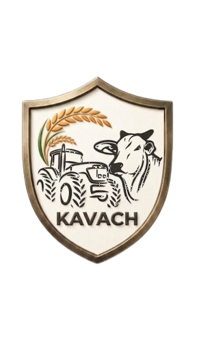
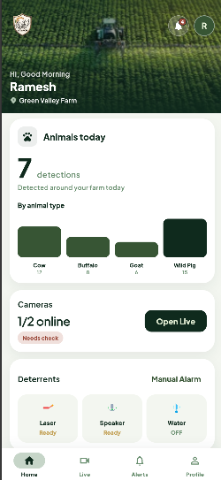
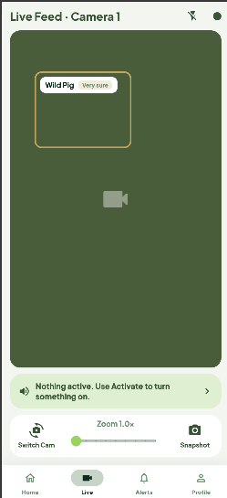
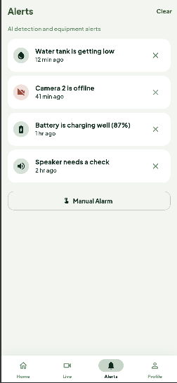
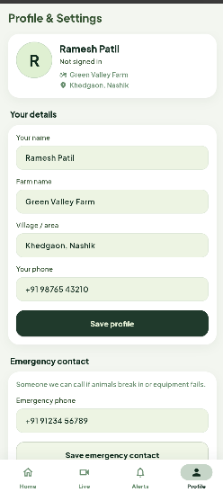
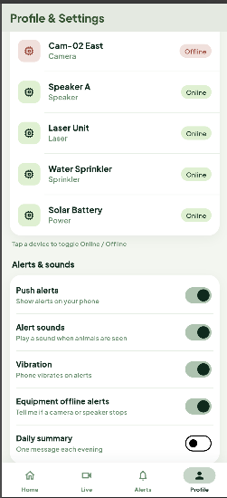
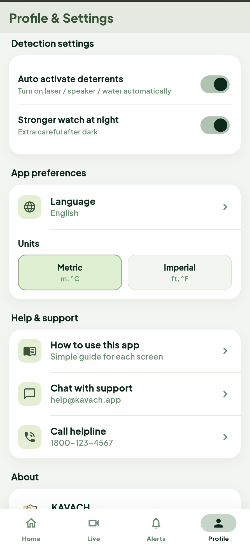
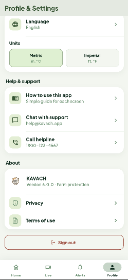

<div align="center">

<h1>
  
  &nbsp;KAVACH
</h1>

### Smart Non-Invasive Stray & Grazing Animal Deterrent System for Crop Protection

**KAVACH** = **K**inetic **A**nimal **V**igilance & **A**utomated **C**rop-guard **H**arness

**TETRA040** · AI-powered farm protection for farmers

KAVACH is a smart, non-invasive deterrent platform that helps farmers protect crops from stray and grazing animals using computer vision, priority-based actuation, and a modern Flutter farmer app — without harming animals or fencing off livelihoods.

<br/>

[](https://flutter.dev)
[](https://github.com/ultralytics/ultralytics)
[](https://www.python.org)
[](https://opencv.org)
[](./LICENSE)

<br/>

[](https://github.com/Devashish-Modi/TETRA040/stargazers)
[](https://github.com/Devashish-Modi/TETRA040/network/members)
[](https://github.com/Devashish-Modi/TETRA040/commits)
[](https://github.com/Devashish-Modi/TETRA040)
[](https://github.com/Devashish-Modi/TETRA040/issues)
[](https://github.com/Devashish-Modi/TETRA040/graphs/contributors)
[](https://github.com/Devashish-Modi/TETRA040/releases)

</div>

---

<p align="center">
  
</p>

---

## Table of Contents

- [Project Overview](#project-overview)
- [KAVACH Farmer App](#kavach-farmer-app)
- [Features](#features)
- [Project Screenshots](#project-screenshots)
- [System Architecture](#system-architecture)
- [Repository Structure](#repository-structure)
- [Tech Stack](#tech-stack)
- [Dependencies](#dependencies)
- [Installation](#installation)
- [Running the Project](#running-the-project)
- [Demo Login](#demo-login)
- [Supported Animals](#supported-animals)
- [Supported Languages](#supported-languages)
- [AI Workflow](#ai-workflow)
- [Deterrent System](#deterrent-system)
- [Hardware](#hardware)
- [Current Status](#current-status)
- [Roadmap](#roadmap)
- [Future Improvements](#future-improvements)
- [Team](#team)
- [Contributing](#contributing)
- [License](#license)
- [Notes](#notes)

---

## Project Overview

### The Problem

Across rural India and many agrarian regions, farmers lose a significant portion of crop yield every season to **stray cattle, buffalo, goats, dogs, and wild pigs**. Traditional responses — night watches, makeshift fencing, or harmful deterrents — are exhausting, expensive, or ethically unacceptable. Night-time breaches are especially hard to catch: a few animals can flatten a field before anyone notices.

Farmers need a system that is **always watching**, **humane**, and **actionable** — not another dashboard that only reports after the damage is done.

### The Solution

**KAVACH** (*Kinetic Animal Vigilance & Automated Crop-guard Harness*; also meaning *shield* / *armor*) is a **smart non-invasive stray & grazing animal deterrent system for crop protection**. It combines:

1. **Computer vision** (YOLOv8 + OpenCV) to detect animals near the perimeter in real time  
2. A **priority engine** that chooses the right response based on animal type, urgency, and conditions  
3. **Non-harmful actuators** — laser, speaker, and water sprinkler — to gently drive animals away  
4. A **Flutter farmer app** so growers can monitor live status, receive alerts, and take manual control from a phone

This repository (**TETRA040**) includes the **KAVACH** farmer mobile app — an AI-assisted farm protection UI for monitoring animals, cameras, deterrents, and alerts.

### Benefits

| Benefit | Description |
|---------|-------------|
| **Humane** | No electric fences or harmful methods — animals are deterred, not injured |
| **Always-on awareness** | Perimeter cameras + AI reduce the need for all-night manual watches |
| **Farmer-first UX** | Simple Flutter app with Home, Live, Alerts, and Profile |
| **Local languages** | English, Hindi, and Gujarati so more farmers can use it comfortably |
| **Manual override** | Farmers can trigger deterrents immediately when needed |
| **Scalable design** | Ready to grow toward IoT (ESP32), cloud backend, and multi-farm dashboards |

### Target Users

- Small and medium **farmers** protecting open or semi-open fields  
- **FPOs / cooperatives** evaluating perimeter protection tools  
- **Hackathon / research teams** building agri-AI + IoT demos  
- Students and builders exploring **YOLOv8 + Flutter + hardware** integration  

### Hackathon Objective

TETRA040 / KAVACH is built to demonstrate an end-to-end **crop protection story**: detect → prioritize → deter → notify the farmer. The current farmer app on branch `farmer-app` showcases the product experience; ML and hardware layers complete the full system vision for judging, demos, and future field trials.

---

## KAVACH Farmer App

| | |
|---|---|
| **App folder** | [`agri_shield_ai/`](./agri_shield_ai/) |
| **Branch** | `farmer-app` |
| **Package** | `agri_shield_ai` |
| **Version** | 6.0.0 |

KAVACH helps farmers watch the farm perimeter, review detections, control deterrents (laser, speaker, sprinkler), and get alerts — in **English**, **Hindi**, and **Gujarati**.

### Farmer app highlights (preserved)

- **Splash → Welcome → Language → Login** onboarding flow  
- **Home** — farm overview, animals today, cameras, deterrents, alerts  
- **Live** — camera monitoring  
- **Alerts** — AI detection and equipment alerts  
- **Profile** — farm details, language, and settings  
- **Manual alarm** — activate deterrents on demand  
- Multi-language UI (EN / HI / GU) with persisted preference  

---

## Features

| Feature | Status | Description |
|---------|--------|-------------|
| **AI Detection** | 🟡 Core / demo | Animal detection pipeline vision using YOLOv8-class models |
| **Live Monitoring** | ✅ App | Watch camera feeds and farm live status from the Flutter app |
| **Manual Control** | ✅ App | Manual alarm / on-demand deterrent activation |
| **Priority Engine** | 🟡 Designed | Chooses laser / speaker / sprinkler based on animal & context |
| **Multi Language** | ✅ App | English, Hindi, Gujarati with persisted locale |
| **Alerts** | ✅ App | AI detection and equipment alerts with dismiss / clear |
| **Dashboard** | ✅ App | Home overview: animals today, cameras, deterrents |
| **Camera** | ✅ App / 🟡 HW | Live camera UI; hardware camera integration in progress |
| **Weather Support** | 🟡 Planned logic | Weather-aware deterrent selection (e.g. rain → prefer speaker) |
| **Equipment Control** | ✅ App | Laser, speaker, sprinkler status cycling in UI |
| **Future IoT** | 🔵 Planned | ESP32 / relay-driven field actuators |
| **Offline Ready** | 🟡 Partial | Local preferences & demo data work without cloud |

> ✅ Completed in farmer app · 🟡 In progress / partial · 🔵 Planned

---

## Project Screenshots

Real captures from the KAVACH farmer app (`agri_shield_ai`).

| Home | Live |
|:----:|:----:|
|  |  |
| Farm overview, animals today, cameras & deterrents | Live feed with AI detection (Wild Pig) |

| Alerts | Profile |
|:------:|:-------:|
|  |  |
| AI detection & equipment alerts | Farm details & emergency contact |

| Devices & alerts | Preferences |
|:----------------:|:-----------:|
|  |  |
| Device online/offline & alert sounds | Detection settings, language & units |

| About |
|:-----:|
|  |
| Help, support & KAVACH about |

---

## System Architecture

```text
                         ┌─────────────────────────┐
                         │     Field Camera(s)     │
                         └────────────┬────────────┘
                                      │
                                      ▼
                         ┌─────────────────────────┐
                         │   OpenCV Preprocessing  │
                         │   (frames / resize)     │
                         └────────────┬────────────┘
                                      │
                                      ▼
                         ┌─────────────────────────┐
                         │        YOLOv8           │
                         │   Animal Detection      │
                         └────────────┬────────────┘
                                      │
                                      ▼
                         ┌─────────────────────────┐
                         │    Detection Events     │
                         │  class · conf · time    │
                         └────────────┬────────────┘
                                      │
                                      ▼
                         ┌─────────────────────────┐
                         │     Priority Engine     │
                         │ animal · urgency · wx   │
                         └────────────┬────────────┘
                                      │
                 ┌────────────────────┼────────────────────┐
                 ▼                    ▼                    ▼
          ┌────────────┐       ┌────────────┐       ┌────────────┐
          │   Laser    │       │  Speaker   │       │ Sprinkler  │
          └──────┬─────┘       └──────┬─────┘       └──────┬─────┘
                 │                    │                    │
                 └────────────────────┼────────────────────┘
                                      ▼
                         ┌─────────────────────────┐
                         │   Flutter Farmer App    │
                         │  (KAVACH / agri_shield) │
                         └────────────┬────────────┘
                                      │
                                      ▼
                         ┌─────────────────────────┐
                         │         Farmer          │
                         │  monitor · alert · act  │
                         └─────────────────────────┘
```

### Component explanations

| Component | Role |
|-----------|------|
| **Camera** | Captures perimeter video / frames for analysis |
| **OpenCV** | Frame grab, resize, color conversion, optional motion ROI |
| **YOLOv8** | Classifies animals (cow, buffalo, goat, wild pig, etc.) |
| **Detection** | Structured events: type, confidence, timestamp, camera id |
| **Priority Engine** | Picks the safest effective actuator sequence |
| **Laser / Speaker / Sprinkler** | Non-invasive deterrents controlled by relays or UI sim |
| **Flutter App** | Farmer-facing UX: home, live, alerts, profile, manual alarm |
| **Farmer** | Receives alerts and can override / confirm actions |

---

## Repository Structure

```text
TETRA040/
├── LICENSE                     # MIT license
├── README.md                   # You are here
├── schema.sql                  # Database schema (animal / system data)
├── assets/                     # Repo-level media (banner, docs)
│   └── banner.png              # Hero banner (replace with actual)
├── screenshots/                # App UI screenshots
│   ├── home.png
│   ├── live.png
│   ├── alerts.png
│   ├── profile.png
│   ├── settings.png
│   ├── preferences.png
│   └── about.png
├── agri_shield_ai/             # ★ KAVACH Flutter farmer app
│   ├── lib/
│   │   ├── screens/            # Splash, welcome, home, live, alerts, profile…
│   │   ├── providers/          # Auth, farm, locale
│   │   ├── l10n/               # EN / HI / GU strings (ARB + generated)
│   │   ├── theme/              # Farm green theme (Material 3)
│   │   ├── widgets/            # Shared UI components
│   │   ├── router/             # go_router navigation
│   │   ├── models/             # Farm / alert / equipment models
│   │   └── main.dart           # App entry
│   ├── assets/
│   │   ├── images/             # Logo, farm photos
│   │   └── icons/              # Animals & equipment SVGs
│   ├── android/ ios/ web/      # Platform runners
│   ├── windows/ linux/ macos/  # Desktop runners
│   └── pubspec.yaml            # Flutter dependencies
└── (future) ml/ · iot/ · api/  # Planned ML, hardware, backend folders
```

### Major folders explained

| Path | Purpose |
|------|---------|
| `agri_shield_ai/` | Complete Flutter farmer application (primary deliverable on `farmer-app`) |
| `agri_shield_ai/lib/screens/` | All user-facing screens and flows |
| `agri_shield_ai/lib/providers/` | State: auth, farm equipment/alerts, locale |
| `agri_shield_ai/lib/l10n/` | Localization sources and generated Dart |
| `agri_shield_ai/assets/` | Branding images and SVG icons |
| `schema.sql` | SQL schema for animal / system persistence |
| `LICENSE` | MIT open-source terms |

---

## Tech Stack

### Flutter (Farmer App)

| Technology | Use |
|------------|-----|
| **Flutter / Dart** | Cross-platform farmer UI |
| **Material 3** | Modern design system |
| **Provider** | State management |
| **go_router** | Declarative navigation |
| **SharedPreferences** | Locale & local settings persistence |
| **flutter_localizations + ARB** | EN / HI / GU (`flutter gen-l10n`) |
| **google_fonts** | Plus Jakarta Sans typography |
| **flutter_svg** | Animal & equipment icons |
| **fl_chart** | Charts (analytics / counts) |

### Machine Learning

| Technology | Use |
|------------|-----|
| **Python** | Detection service / scripts |
| **YOLOv8 (Ultralytics)** | Real-time animal detection |
| **OpenCV** | Capture & preprocessing |
| **NumPy / related** | Array / tensor helpers (as required by stack) |

### Hardware

| Component | Use |
|-----------|-----|
| **Camera** | Perimeter vision |
| **Raspberry Pi** (target) | Edge inference host |
| **ESP32** (future) | Wireless actuator control |
| **Relay module** | Switch laser / speaker / pump |
| **Laser module** | Visual deterrent |
| **Speaker** | Acoustic deterrent |
| **Water sprinkler** | Gentle spray deterrent |

### Backend (future)

| Technology | Planned use |
|------------|-------------|
| REST / WebSocket API | Push detections & device status to app |
| PostgreSQL / Supabase | Farms, devices, alert history (`schema.sql` foundation) |
| Auth service | Secure farmer accounts beyond demo login |

---

## Dependencies

### Flutter dependencies (`agri_shield_ai/pubspec.yaml`)

| Package | Why it is used |
|---------|----------------|
| `flutter` / `cupertino_icons` | Core SDK & icons |
| `provider` | Auth, farm, and locale controllers |
| `go_router` | Splash → welcome → shell routes |
| `shared_preferences` | Persist language & settings on device |
| `flutter_localizations` + `intl` | i18n plumbing |
| `google_fonts` | Brand typography |
| `flutter_svg` | Crisp SVG icons for animals / equipment |
| `fl_chart` | Detection charts on home / analytics |
| `flutter_lints` (dev) | Static analysis |

### Python / ML (`requirements.txt` — add at repo root when ML lands)

```text
# Example target stack — keep in sync with your ML folder
ultralytics>=8.0.0
opencv-python>=4.8.0
numpy>=1.24.0
torch                    # or torch matching your CUDA / CPU setup
Pillow>=10.0.0
```

| Dependency | Explanation |
|------------|-------------|
| **ultralytics** | YOLOv8 train / infer API |
| **opencv-python** | Camera capture & image ops |
| **numpy** | Numerical arrays for frames / tensors |
| **torch** | Backend for YOLO weights |
| **Pillow** | Image I/O helpers |

---

## Installation

### 1. Clone the repository

```bash
git clone https://github.com/Devashish-Modi/TETRA040.git
cd TETRA040
git checkout farmer-app
```

### 2. Flutter setup

1. Install [Flutter](https://docs.flutter.dev/get-started/install) (stable)  
2. Ensure `flutter doctor` is healthy for your target (Chrome / Android / Windows)  
3. Enter the app directory:

```bash
cd agri_shield_ai
flutter pub get
```

### 3. Python / ML setup (when detection scripts are present)

```bash
python -m venv .venv
# Windows
.venv\Scripts\activate
# macOS / Linux
source .venv/bin/activate

pip install -r requirements.txt
```

### 4. Environment / secrets

- Keep secrets in `agri_shield_ai/.env` **locally**  
- `.env` is **not** committed (see `agri_shield_ai/.gitignore`)  
- Never paste auth tokens into the README or public issues  

### 5. Directory check after install

```text
TETRA040/
└── agri_shield_ai/     # flutter pub get completed
    ├── .dart_tool/
    ├── lib/
    └── pubspec.lock
```

---

## Running the Project

### Flutter — Chrome (recommended for quick UI demos)

```powershell
cd agri_shield_ai
flutter pub get
flutter run -d chrome
```

After **asset** or major UI changes, do a **full restart** (`R` in the terminal), not only hot reload.

### Flutter — Android

```bash
flutter devices
flutter run -d <android-device-id>
```

### Flutter — Windows desktop

```bash
flutter run -d windows
```

> Note: Windows builds may require Developer Mode for plugin symlinks on some machines.

### Python detection (when ML module is available)

```bash
python detect.py --source 0          # webcam
python detect.py --source farm.mp4   # video file
```

Wire detection outputs to the priority engine / app API as your integration matures.

---

## Demo Login

Use these credentials in the Flutter app demo auth flow:

| Mode | Identifier | Password |
|------|------------|----------|
| **Phone** | `9876543210` | `farm1234` |
| **Username** | `ramesh` | `farm1234` |

| Field | Example |
|-------|---------|
| Display name (register demo) | `Ramesh Patil` |

---

## Supported Animals

| Animal | Typical risk | Notes |
|--------|--------------|-------|
| **Cow** | High (grazing herds) | Common stray cattle scenario |
| **Buffalo** | High | Larger body mass / crop damage |
| **Goat** | Medium–High | Agile; often in groups |
| **Dog** | Variable | May be stray packs near farms |
| **Wild Pig** | High (night) | Priority deterrent sequences |
| **Others** | Configurable | Extend YOLO classes as needed |

---

## Supported Languages

| Language | Code | Where configured |
|----------|------|------------------|
| **English** | `en` | `lib/l10n/app_en.arb` |
| **Hindi** | `hi` | `lib/l10n/app_hi.arb` |
| **Gujarati** | `gu` | `lib/l10n/app_gu.arb` |

Locale is chosen during onboarding and can be changed later in **Profile → Language**. Preference is persisted with SharedPreferences.

---

## AI Workflow

End-to-end detection → action path (10+ steps):

1. **Capture** — Camera streams frames from the farm perimeter.  
2. **Preprocess** — OpenCV resizes / normalizes frames for the model.  
3. **Infer** — YOLOv8 predicts bounding boxes and class labels.  
4. **Filter** — Drop low-confidence or non-animal classes.  
5. **Track (optional)** — Associate detections across frames to reduce flicker.  
6. **Eventize** — Create a detection event (animal, confidence, camera, time).  
7. **Prioritize** — Priority engine ranks severity (e.g. wild pig at night > distant goat).  
8. **Select actuator** — Choose laser, speaker, sprinkler, or a sequenced combo.  
9. **Weather gate** — Adjust choice if rain / wet ground makes sprinkler less ideal.  
10. **Actuate** — Fire relays / simulated equipment for a timed pulse.  
11. **Notify** — Push or surface an alert in the Flutter app.  
12. **Farmer review** — Farmer opens Alerts / Live; can dismiss or manually escalate.  
13. **Log** — Store history for analytics and future model improvement.  
14. **Cool-down** — Avoid actuator spam with cooldown windows per zone.  

---

## Deterrent System

### Laser

- Short, directed visual stimulus to discourage approach  
- Best when animals are visible and lighting allows the beam to be noticed  
- Used as an early / low-intensity step in many sequences  

### Speaker

- Acoustic deterrent (tones / recorded cues)  
- Works in poor visibility and can cover a wider area  
- Preferred when visual deterrents are less effective  

### Water Sprinkler

- Gentle spray startles without harm  
- Strong near crop edges where animals enter  
- May be deprioritized in heavy rain (weather-based logic)  

### Priority Logic

| Priority input | Example behavior |
|----------------|------------------|
| Animal class | Wild pig → stronger / multi-step sequence |
| Confidence | High confidence → act; low → watch / alert only |
| Recurrence | Repeat visits → escalate speaker → sprinkler |
| Manual override | Farmer alarm always wins |

### Weather Based Logic

| Condition | Preference |
|-----------|------------|
| Clear night | Laser + speaker |
| Rain | Prefer speaker; delay sprinkler |
| High wind | Shorter spray cycles; rely on sound |

---

## Hardware

| Hardware | Role | Status |
|----------|------|--------|
| **Camera** | Vision input | Required |
| **Raspberry Pi** | Edge host for YOLO | Target / in progress |
| **ESP32** | Wireless IoT controller | Future |
| **Relay** | Switch AC/DC loads safely | Planned with actuators |
| **Laser module** | Visual deterrent | Planned / prototype |
| **Speaker** | Acoustic deterrent | Planned / prototype |
| **Sprinkler + pump** | Water deterrent | Planned / prototype |

Electrical safety, enclosure IP rating, and farm power (battery / solar) should be validated before any field deployment.

---

## Current Status

| Area | State | Detail |
|------|-------|--------|
| Flutter farmer app (`agri_shield_ai`) | ✅ **Completed** | Onboarding, home, live, alerts, profile, EN/HI/GU |
| Branding & logo | ✅ **Completed** | KAVACH shield identity in app assets |
| Demo auth & sample alerts | ✅ **Completed** | Local demo credentials & sample data |
| YOLOv8 training / field weights | 🟡 **In Progress** | Model + dataset iteration |
| Priority engine software | 🟡 **In Progress** | Logic design + app simulation |
| Live hardware actuation | 🔵 **Planned** | Relays + ESP32 / Pi bridge |
| Production backend | 🔵 **Planned** | Auth, sync, multi-device |
| Field pilot | 🔵 **Planned** | Partner farm trial |

---

## Roadmap

### Now

- Polish farmer app UX and localization  
- Document architecture & demo flow  
- Stabilize Chrome / mobile preview builds  

### Next Release

- Connect detection events into the Alerts feed  
- Real camera source option for Live  
- Exportable detection logs  

### Future Version

- Full IoT actuator mesh (ESP32)  
- Multi-farm dashboard for cooperatives  
- On-device / edge-optimized YOLO  
- Weather API integration for smarter priority  

---

## Future Improvements

- Replace demo alerts with live inference stream  
- Add push notifications for urgent breaches  
- Farm map / geofenced camera zones  
- Role-based access (owner vs helper)  
- Solar + battery power monitoring in Profile  
- Dataset expansion for regional animal breeds  
- Night IR camera profile presets  
- Voice prompts in Hindi / Gujarati for alerts  
- Automated weekly crop-risk report  
- CI for Flutter analyze + widget tests  
- Containerized ML inference service  
- OTA config for deterrent intensity  

---

## Team

| Role | Name | Focus |
|------|------|-------|
| **Leader** | _TBD_ | Vision, coordination, demos |
| **Flutter** | _TBD_ | KAVACH farmer app (`agri_shield_ai`) |
| **ML** | _TBD_ | YOLOv8, OpenCV, datasets |
| **IoT** | _TBD_ | Pi / ESP32 / relays / actuators |
| **Backend** | _TBD_ | API, auth, database |

Update this table with real names and GitHub handles when ready.

---

## Contributing

We welcome improvements that make KAVACH more useful for farmers.

### How to contribute

1. **Fork** the repository  
2. **Create a branch**  
   ```bash
   git checkout -b feature/your-feature-name
   ```  
3. **Make focused changes** (prefer `agri_shield_ai/` for app work)  
4. **Test**  
   ```bash
   cd agri_shield_ai
   flutter analyze
   flutter test
   ```  
5. **Commit** with a clear message  
6. **Open a Pull Request** against `farmer-app` (app) or the appropriate branch  

### Guidelines

- Do not commit `.env`, keys, or personal tokens  
- Keep PRs small and described (what / why / how tested)  
- Match existing Flutter style and localization patterns  
- Add EN + HI + GU strings for any new user-facing text  
- Be respectful in issues and reviews  

### Reporting bugs

Open a GitHub Issue with:

- Steps to reproduce  
- Expected vs actual behavior  
- Device / OS / Flutter version  
- Screenshots if UI-related  

---

## License

This project is released under the **MIT License**.

See the full text in [LICENSE](./LICENSE).

```text
MIT License — free to use, modify, and distribute with attribution.
```

---

## Notes

- Keep secrets in `.env` locally — it is **not** committed (see `agri_shield_ai/.gitignore`).  
- Camera views and alerts in the current build use **demo / sample data**.  
- After asset changes in Flutter, use a **full restart** (`R`), not only hot reload.  
- App UI screenshots live under `screenshots/`; banner under `assets/banner.png`.  

---

<div align="center">

### Made with ❤️ for farmers

**Flutter** · **YOLOv8** · **Python** · **OpenCV**

🌾 **KAVACH** — *Shielding crops. Respecting life.*

[](https://github.com/Devashish-Modi/TETRA040)

</div>
